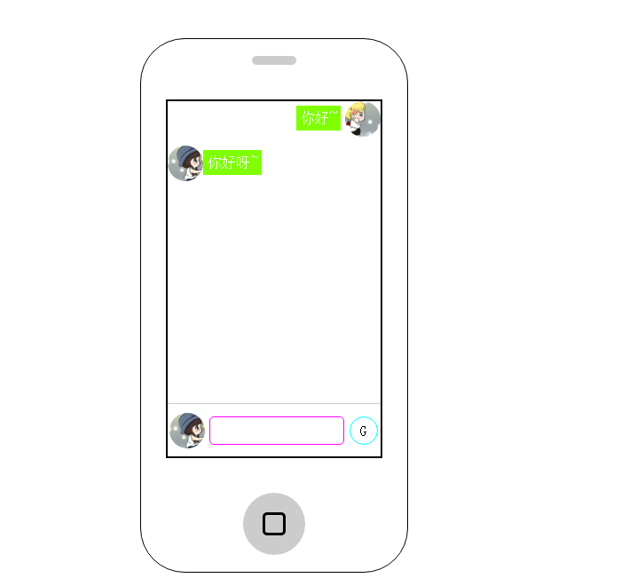

# 总结:
	1. 布局采用flex布局
	2. 封装一个id函数，避免重复写document.getElementById
	3. 获取输入框内容，写在i标签内，头像的创建，全部是createElement，然后添加样式，最后appendChild，清除输入框内容
	
# 解决的一个小问题：
	1. 因为i标签不设置定宽，当文本输入过多，文本显示会因为i标签的浮动而全部换行，要设置适当的max-width
	
	
## 在线预览：https://yittang.github.io/practice/JS仿手机聊天/index.html

### 
